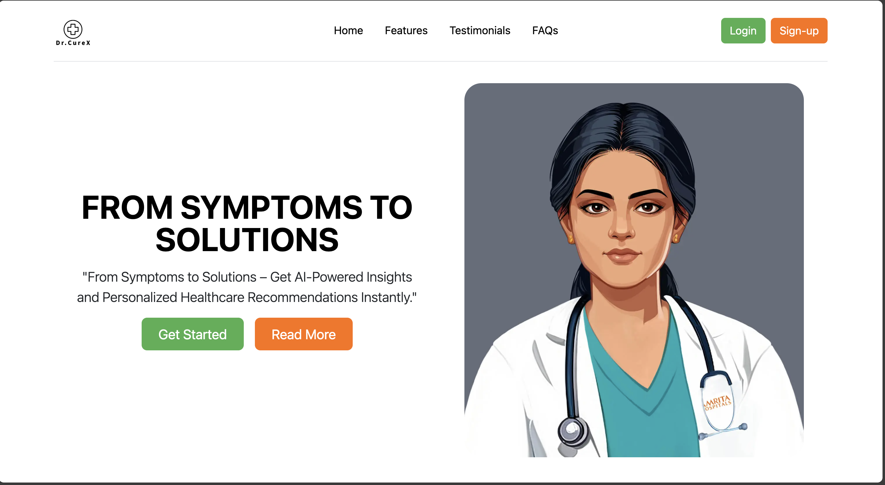

# Dr.CureX: LLM Enabled AI-Health App 



---

## 📦 Installation Guide  

### 1️⃣ Clone the Repository  
```sh
git clone https://github.com/your-repo/dr-curex.git  
cd dr-curex
```
### 2️⃣ Install Required Dependencies:  
```sh
npm i
```
```sh
npm i nodemon react-bootstrap bootstrap react-scroll
```
### 3️⃣ Start the Development Server
```sh
npm run dev
```
